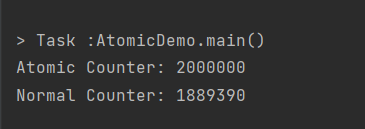
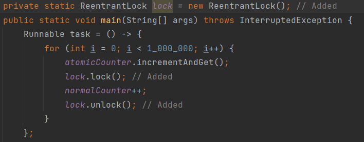
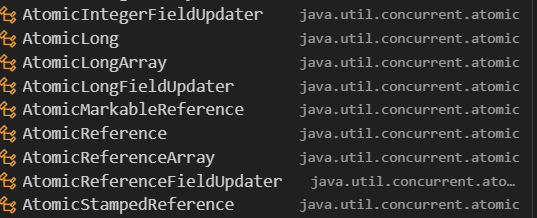

### 1. `Atomic Variables`

```java  
import java.util.concurrent.atomic.AtomicInteger;
public class AtomicDemo {
  private static AtomicInteger atomicCounter = new AtomicInteger(0);
  private static int normalCounter = 0;
  public static void main(String[] args) throws InterruptedException {
    Runnable task = () -> {
      for (int i = 0; i < 1_000_000; i++) {
        atomicCounter.incrementAndGet();
        normalCounter++;
      }
    };

    Thread t1 = new Thread(task);
    Thread t2 = new Thread(task);
    t1.start();
    t2.start();
    t1.join();
    t2.join();

    System.out.println("Atomic Counter: " + atomicCounter);
    System.out.println("Normal Counter: " + normalCounter);
  }
}
  
```  

**Questions:**

- What output do you get from the program? Why?

    

        The reason of this output is that the normal counter is using ++
        which is not thread-safe. When two threads are executing at the 
        same time, they may both read the value of the counter, increment
        it, and then write the new value. This can result in the value being
        incremented twice, leading to an incorrect count.
    
        to fix it we can use ReentantLock or synchronized keyword to make
        it thread-safe.

        For example:

    


- What is the purpose of AtomicInteger in this code?


        1 AtomicInteger doesn't need Locks
        2 AtomicInteger is Thread-safe
        3 AtomicInteger is faster than normal counter
        4 AtomicInteger is used for atomic operations
        5 To compare handling multi-threads between int and AtomicInteger


- What thread-safety guarantees does atomicCounter.incrementAndGet() provide?

        During the increment no other threads can acsses to it.
        Doesn't need to use locks or synchronized it uses hardware-
        level opreations like CAS (Compare and Swap) to make it
        thread-safe.


- In which situations would using a lock be a better choice than an atomic variable?

        When we need to work with multiple variables or complex operations.


- Besides AtomicInteger, what other data types are available in the java.util.concurrent.atomic package?


    *   AtomicIBoolean
    *   AtomicIntegerArray
    *   AtomicLong
    *   Atomic
    *   Others...
    

---  